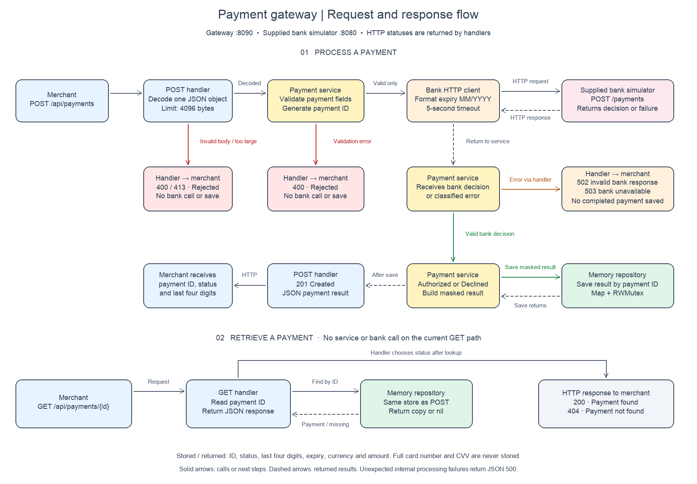

# Tmplementation documantation & Instructions for running the app

This is the Go version of the Payment Gateway challenge. If you haven't already read the [README.md](https://github.com/cko-recruitment/) in the root of this organisation, please do so now. 

## Table of contents

- [Template structure](#template-structure)
  - [Swagger](#swagger)
- [Initial observations](#initial-observations)
- [Running the solution](#running-the-solution)
- [Payment API](#payment-api)
  - [Create a payment](#create-a-payment)
  - [Retrieve a payment](#retrieve-a-payment)
  - [Rejected input and bank failures](#rejected-input-and-bank-failures)
- [Validation and assumptions](#validation-and-assumptions)
- [Key design considerations](#key-design-considerations)
  - [Scope and limitations](#scope-and-limitations)
- [Tests and verification](#tests-and-verification)

## Template structure
```
main.go - a skeleton Payment Gateway API
imposters/ - contains the bank simulator configuration. Don't change this
docs/docs.go - Generated file by Swaggo
.editorconfig - don't change this. It ensures a consistent set of rules for submissions when reformatting code
docker-compose.yml - configures the bank simulator
.goreleaser.yml - Goreleaser configuration
```

Feel free to change the structure of the solution, use a different test library etc.

### Swagger
This template uses Swaggo to autodocument the API and create a Swagger spec. The Swagger UI is available at http://localhost:8090/swagger/index.html.

## Initial observations

Reviewing the starter code and running its tests identified the following gaps.
These observations guided the implementation; the repository already provided
working in-memory save and retrieval methods.

| Observation before implementation | Change made |
| --- | --- |
| `TestGetPaymentHandler/PaymentNotFound` expected `404`, but the GET handler returned `204 No Content` for an unknown ID. | Corrected the handler to return `404 Not Found`; missing-payment responses now include a JSON error. |
| There was no payment service layer to coordinate validation, bank authorization and storage. | Added `PaymentService` to perform these operations separately from HTTP handling. |
| `PostHandler` was a TODO returning `nil`, so payment creation was not implemented. | Implemented and registered `POST /api/payments`, connected it to the service, and added handler tests. |
| The request model contained only the last four card digits, although the bank requires the full card number. | Added the full card number to the request model while retaining only the last four digits in stored results and responses. |
| CVV and last-four fields were integers, which cannot retain leading zeros. | Changed these fields to strings and tested leading-zero values. |
| The repository stored payments in a slice, used a linear lookup, and had no synchronization for concurrent access. | Replaced it with a map keyed by payment ID, protected reads and writes with an `RWMutex`, and added repository and race-detector tests. |
| The supplied bank simulator existed, but the gateway had no HTTP client to call it. | Added a client for the supplied simulator, including payload conversion, timeout, cancellation and response checks. The simulator itself was unchanged. |

## Running the solution

Requirements: Go 1.21 or later, Docker with Compose, and available local ports
8080 (bank simulator), 8090 (gateway), and 2525 (simulator administration).
Run the following from the repository root with Docker running:

```sh
docker compose up -d
go run .
```

In another terminal, check that the gateway is running:

```sh
curl -i http://localhost:8090/ping
```

The health endpoint returns `200` and `{"message":"pong"}`. It does not check the
bank connection. Restart `go run .` after changing Go files; it does not reload
changes automatically. Stop the gateway with Ctrl+C and the simulator with
`docker compose down`.

The gateway currently connects to the supplied simulator at
`http://localhost:8080`, configured in `internal/api/api.go`. The simulator is
provided by the assessment; `internal/bank/client.go` is the HTTP client that
calls it, not a replacement simulator.

## Payment API

### Create a payment

```sh
curl -i http://localhost:8090/api/payments \
  -H 'Content-Type: application/json' \
  -d '{
    "card_number": "2222405343248877",
    "expiry_month": 12,
    "expiry_year": 2099,
    "currency": "GBP",
    "amount": 100,
    "cvv": "123"
  }'
```

A successful bank authorization returns `201 Created` with a generated ID:

```json
{
  "id": "example-generated-payment-id",
  "payment_status": "Authorized",
  "card_number_last_four": "8877",
  "expiry_month": 12,
  "expiry_year": 2099,
  "currency": "GBP",
  "amount": 100
}
```

Amounts are in minor currency units: `100` GBP means £1.00. Card numbers, CVVs,
and last-four digits are strings to retain leading zeros. The client converts
`expiry_month` and `expiry_year` into the simulator's `expiry_date` format
(`MM/YYYY`) when making `POST http://localhost:8080/payments`.

The supplied simulator decides the outcome from the last card digit:

| Last digit | Outcome |
| --- | --- |
| 1, 3, 5, 7, 9 | Authorized payment; gateway returns `201` |
| 2, 4, 6, 8 | Declined payment; gateway returns `201` with `Declined` |
| 0 | Bank unavailable; gateway returns `503` |

A declined payment is still a created, retrievable record. These are simulated
payments; no real funds move.

### Retrieve a payment

Use the ID from the POST response:

```sh
curl -i http://localhost:8090/api/payments/YOUR_PAYMENT_ID
```

Returns `200` with the same safe payment fields. Unknown IDs return `404`:

```json
{"error":"payment not found"}
```

Retrieval reads storage without calling the bank. Restarting the gateway clears
all payment records because storage is in memory.

### Rejected input and bank failures

For example, changing the amount to `-100` returns `400`:

```json
{
  "error": "invalid payment: amount must be positive",
  "payment_status": "Rejected"
}
```

| Condition | HTTP status | Response behavior |
| --- | --- | --- |
| Authorized or declined decision | `201` | Payment result saved and returned |
| Existing payment retrieved | `200` | Stored payment returned |
| Validation failure | `400` | JSON error with `Rejected`; no bank call |
| Malformed, empty, null, wrong-type, unknown-field, or trailing JSON input | `400` | JSON error with `Rejected`; no bank call |
| Request body over 4096 bytes | `413` | JSON error with `Rejected`; no bank call |
| Unknown payment ID | `404` | JSON error |
| Bank connection failure, request timeout, or bank 5xx response | `503` | `{"error":"bank unavailable"}` |
| Unexpected bank status or invalid decision response | `502` | `{"error":"invalid bank response"}` |
| Unexpected internal processing failure | `500` | Generic JSON error |

Bank failures are not labelled `Declined` or `Rejected` and do not create a
completed payment record. Raw bank error bodies are not returned to callers.
The POST handler permits trailing whitespace but requires a single payment
object. Examples send `Content-Type: application/json`; the handler currently
does not enforce that header. The JSON-error contract above covers implemented
payment handlers, not the router's default unknown-route/method responses.

## Validation and assumptions

- Card number: 14–19 ASCII digits.
- Expiry month: 1–12; expiry year: 1–9999, with an unexpired month/year combination.
- A card is valid through the end of its expiry month in UTC.
- Supported currencies are exactly `GBP`, `USD`, and `EUR` (case-sensitive).
- Amount is an integer and must be positive. Positivity is an explicit assumption
  beyond the brief's integer requirement. With an `int` field, missing/null and
  zero amounts all fail the positive-amount check.
- CVV: 3–4 ASCII digits. Full card numbers and CVVs are sent only to the bank and
  are not included in stored payment results or API responses.
- Payment IDs are independently generated random 128-bit values, encoded as hex.
- No Luhn check is added; the assessment specifies digit and length validation.

## Key design considerations



- **Handlers** decode HTTP requests, call the service for processing, map errors
  to HTTP statuses, and write JSON. GET currently reads the repository directly.
- **Service** validates input, generates the payment ID, requests authorization,
  and saves the masked result. Its small `Bank` interface allows tests to supply
  controlled responses without Docker. Validation happens before a bank call.
- **Repository** uses a map keyed by payment ID, protected by `sync.RWMutex` for
  concurrent reads/writes. Retrieval returns a copy. Saving an existing ID
  replaces its value; normal processing generates a fresh ID per payment.
- **Bank client** translates the payload, forwards the request context, applies a
  five-second HTTP timeout, and checks the response. Redirects are not followed
  to avoid forwarding card data elsewhere. An explicit `authorized: false` is
  a decline; a missing/null/nonboolean decision is an invalid response.
- **Startup wiring** creates one repository and service shared by the handlers.

Only the last four card digits and the response fields are persisted. Request
bodies are not explicitly logged; the template's middleware logs HTTP access
information. The implementation adds no new runtime libraries or database.
The supplied `imposters/` configuration and `.editorconfig` are unchanged.

### Scope and limitations

This is an assessment implementation, not a production payment processor.
Storage is not durable, authentication and merchant isolation are not implemented,
and repeated POSTs create separate payments. Automatic retries are deliberately
absent: after a timeout, the bank may already have processed a payment. Production
idempotency and reconciliation would require additional design.

The template Swagger UI remains available at `/swagger/index.html`, but its
existing generated specification has not been updated for these payment routes.
The endpoint examples and contract in this README describe the implemented API.

## Tests and verification

Run from the repository root:

```sh
go test ./...
go test -race ./...
go vet ./...
go build ./...
```

Tests use local `httptest` servers and small bank test doubles; Docker is not
required. Tests cover:

- Service validation and valid boundaries, including zero bank calls on rejection.
- Authorized and declined payment persistence and retrieval.
- Repository lookup, replacement, copy isolation, and concurrent access.
- Handler statuses, safe response fields, JSON errors, and request-body limits.
- Real bank-client request formatting, authorization/decline decoding, timeout,
  cancellation, and redirect prevention.
- Bank errors through the handler, service, and real HTTP client using controlled
  local server responses.

The supplied Docker simulator has also been exercised manually for authorization,
retrieval, decline and unavailability. Restart the gateway before a manual check
of newly changed error mappings; an already-running process uses the older code.

For coverage:

```sh
go test -coverprofile=coverage.out ./...
go tool cover -func=coverage.out
go tool cover -html=coverage.out
```

Do not commit generated coverage reports or binaries.
